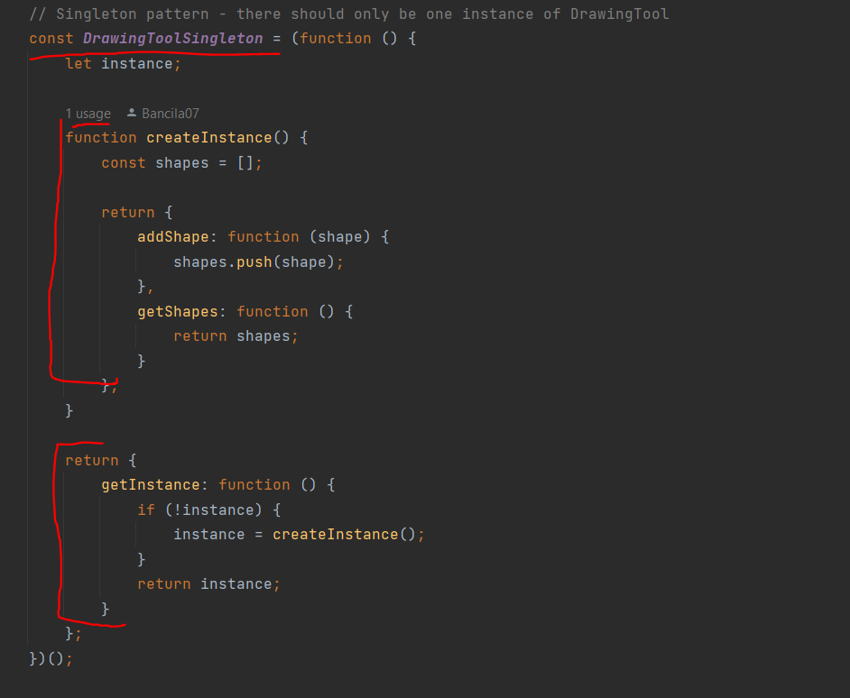
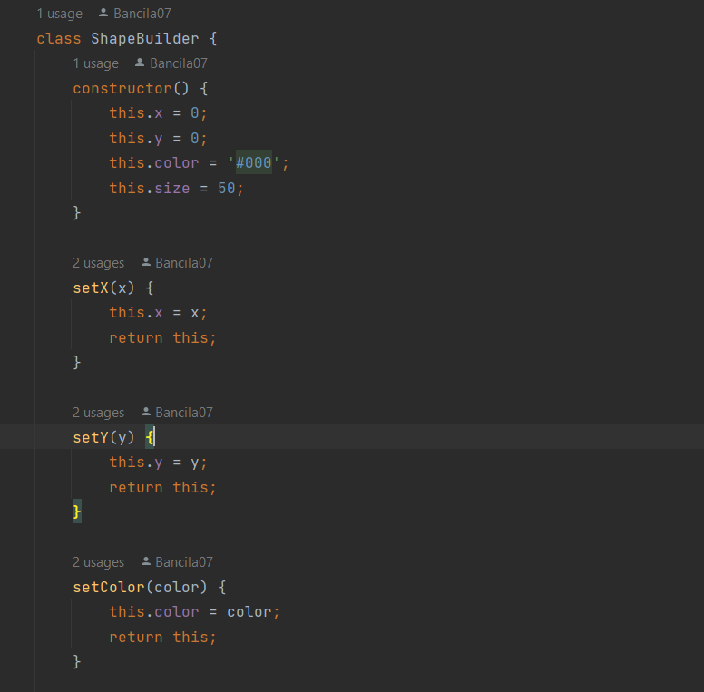
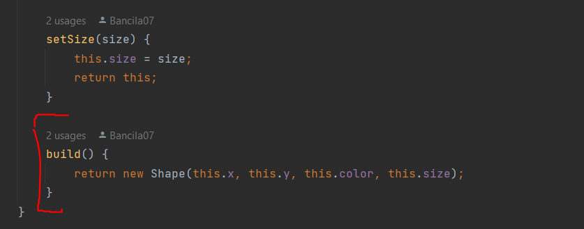
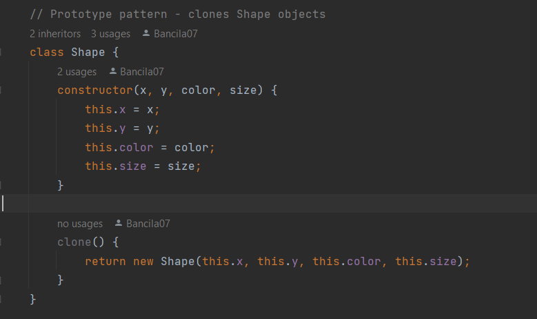
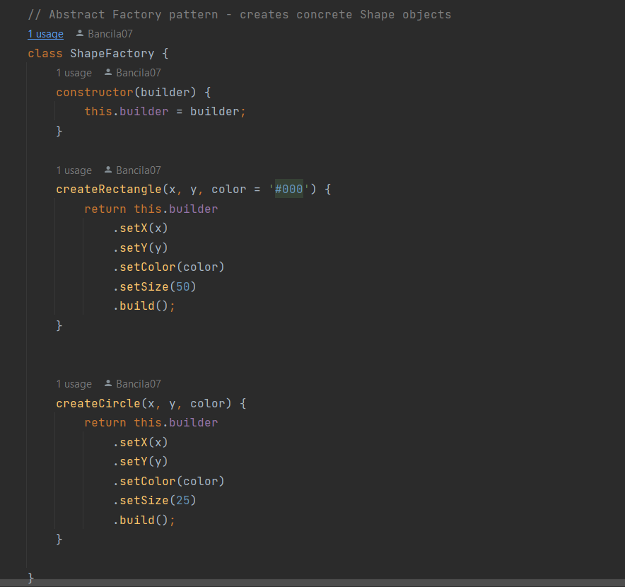

Despre aplicație

>Acesta este un cod pentru o unealtă de desenare pe care utilizatorii o pot utiliza pentru a adăuga cercuri și dreptunghiuri pe o zonă de desen. Codul este scris în limbajul HTML, CSS și JavaScript și este structurat într-un mod modular, folosind modele de design precum Singleton, Builder, Prototype și Abstract Factory.

>Pentru a începe să utilizați acest cod, deschideți fișierul HTML într-un browser web compatibil și veți vedea o zonă de desen și două butoane - unul pentru adăugarea unui dreptunghi și unul pentru adăugarea unui cerc. Atunci când un utilizator apasă unul dintre aceste butoane, se creează un obiect de formă și se adaugă la lista de forme, după care se desenează toate formele existente pe zona de desen.

>Pentru a citi și înțelege mai bine codul, urmăriți comentariile care explică modelele de design și componentele specifice ale codului. În plus, acest cod poate fi modificat și îmbunătățit pentru a se potrivi nevoilor dvs. specifice de dezvoltare a aplicațiilor web.

Obiective
>1. Studiați și înțelegeți modelele de proiectare structurală.
>2. Ca o continuare a lucrărilor anterioare de laborator,
gândiți-vă la funcționalitățile pe care sistemul dumneavoastră va trebui să le ofere utilizatorului.
>3. Implementați câteva funcționalități suplimentare sau creați un nou proiect
folosind modele de proiectare structurală.

Modele de design folosite
>Modelul Singleton
>Modelul Builder
>Modelul Prototype
>Modelul Abstract Factory

Implementation
>Modelul Singleton garantează că există doar o instanță a unei anumite clase. În acest caz, clasa este DrawingToolSingleton, care definește o instanță unică a instrumentului de desenare și metode pentru a adăuga și a obține forme desenate.

>Modelul Builder este folosit pentru a crea obiecte complexe prin setarea progresivă a valorilor pentru diferitele proprietăți ale obiectului. Clasa ShapeBuilder definește o astfel de abordare pentru crearea formelor de desen.

> Modelul Prototype este utilizat pentru a clona obiecte existente, în loc să se creeze noi obiecte de fiecare dată când este necesară o instanță. Clasa Shape definește o metodă de clonare, astfel încât obiectele de formă pot fi clonate în loc să fie create.

>Modelul Abstract Factory oferă o interfață comună pentru crearea unui grup de obiecte legate sau dependente, în acest caz forme de desen. Clasa ShapeFactory folosește un obiect Builder pentru a crea instanțe concrete ale claselor Rectangle și Circle, ambele fiind forme de desen cu proprietăți diferite.

Conclusion
>În implementarea prezentată, am folosit următoarele modele de proiectare:

>Singleton: asigură că există doar o instanță a unei clase (DrawingToolSingleton) pentru gestionarea formelor de desen.
>Builder: creează obiecte complexe (forme de desen) prin setarea progresivă a proprietăților acestora.
>Prototype: permite clonarea obiectelor existente (forme de desen) pentru a evita crearea repetată de instanțe noi.
>Abstract Factory: oferă o interfață comună (ShapeFactory) pentru crearea unui grup de obiecte legate (forme de desen) cu proprietăți diferite.
>Aceste modele ne permit să gestionăm și să manipulăm eficient formele de desen în aplicație, oferind flexibilitate și reutilizabilitate în procesul de creare și >utilizare a acestora.

